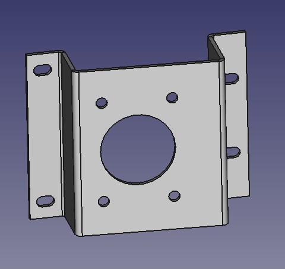

# Hydro Thunder CAD Replacement and Support Components  
  
## Hydro Thunder Dashboard Brace

This is a 3D printable part to clamp down on the dashboard to reinforce the frequently broken plastic that secures it to the metal base. The parts are printed with one as modeled and the other mirrored from the original. The are installed with the original bolts over the plastic dashboard.

Adding foam to the bottom of the parts before putting them on may make them work even better as it will increase friction by fitting into the textured surface more.

## Sheet Metal Version

A sheet metal bend version is also available. You will need to add it twice to your cart with one being bent up and the other down.

**[CRS Mild Steel 0.119" (3mm)](https://sendcutsend.com/materials/mild-steel/):**  
 - K-Factor: `0.38`  
 - Bend Radius: `1.6002 mm`  
 - Thickness: `3.0226 mm`

Bend Values(Per SendCutSend order) - Left side:  
 - **1**: 80 - Up  

Bend Values(Per SendCutSend order) - RIght side:  
 - **1**: 80 - Down  

After you order parts and go to install them, I highly recommend adding felt or foam to the inside part of the metal that contacts the plastic to both add friction and apply the force more evenly when clamping.

## Hydro Thunder Throttle Mount Plate

The intermediate mounting bracket to attach the throttle to the control panel is prone to tearing. The file `HydroThrottleplate-Unfold.dxf` is a replacement design for this made in a thicker piece of steel to both repair and prevent future damage. The design file is designed against material of the follow parameters availble at [sendcutsend.com](https://sendcutsend.com)  
  
**[CRS Mild Steel 0.119" (3mm)](https://sendcutsend.com/materials/mild-steel/):**  
 - K-Factor: `0.38`  
 - Bend Radius: `1.6002 mm`  
 - Thickness: `3.0226 mm`

Bend Values(Per SendCutSend order):  
 - **1** (Tall side mount tab): 90 - Up  
 - **2** (Tall side inner): 94.1596 - Down  
 - **3** (Short side inner): 85.8404 - Down
 - **4** (Short side mount tab): 90 - Up  

If you want to change the material type you will need to modify the FreeCAD design file which uses the [SheetMetal Workbench](https://wiki.freecad.org/SheetMetal_Workbench) plugin. The K-factor is set on the unfolding of an object, material thickness and bend radius are set for the plugin on the base level object but for this project are referenced from a spreadsheet to make adjustments easier.